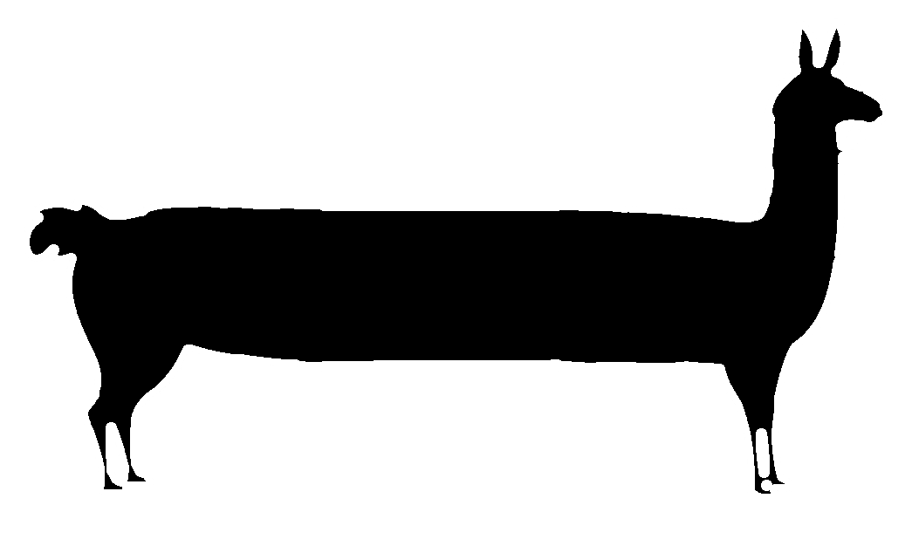
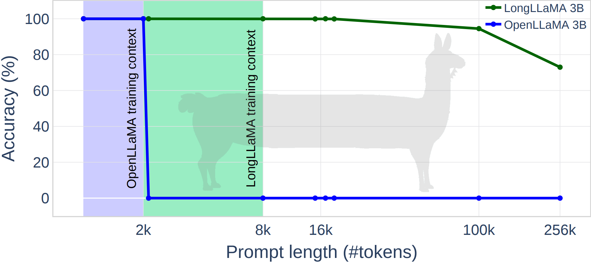

<p align="center" width="100%"></p>

# LongLLaMA: Focused Transformer Training for Context Scaling


<div align="center">


<table>

  <tr>
  <td align="center">
    <span style="font-size:300%">{</span>
    </td>
    <td align="center">
    <span style="font-size:115%">
    <b>
    <a href="https://huggingface.co/syzymon/long_llama_code_7b" tyle="margin-bottom:30px">LongLLaMA Code-7B</a>
    </b>
    </span>
    </td>
    <td align="center">
    <span style="font-size:300%">}</span>
    </td>

 </tr>
</table>


</div>

<div align="center">

<table>
  <tr>
    <th> <a href="https://huggingface.co/syzymon/long_llama_3b_instruct">LongLLaMA-Instruct-3Bv1.1</a> </th>
    <th> <a href="https://huggingface.co/syzymon/long_llama_3b_v1_1">LongLLaMA-3Bv1.1</a></th>
  </tr>
  <tr>
    <td align="center">
    <a  href="https://colab.research.google.com/github/CStanKonrad/long_llama/blob/main/long_llama_instruct_colab.ipynb"></a>
    </td>
    <td align="center">
    <a href="https://colab.research.google.com/github/CStanKonrad/long_llama/blob/main/long_llama_colab.ipynb"></a>
    </td>
 </tr>
</table>

</div>

<div align="center">

 [TLDR](#TLDR) | [Overview](#Overview) | [Usage](#Usage) | [LongLLaMA performance](#LongLLaMA-performance) | [Authors](#Authors) | [Citation](#Citation) | [License](#License) | [Acknowledgments](#Acknowledgments)
 
 [FoT continued pretraining](fot_continued_pretraining) | [Instruction tuning](instruction_fine_tuning)

</div>

## TLDR
This repository contains the research preview of **LongLLaMA, a large language model capable of handling long contexts of 256k tokens or even more**. 

LongLLaMA is built upon the foundation of [OpenLLaMA](https://github.com/openlm-research/open_llama) and fine-tuned using the [Focused Transformer (FoT)](https://arxiv.org/abs/2307.03170) method.
LongLLaMA Code is built upon the foundation of [Code Llama](https://huggingface.co/codellama/CodeLlama-7b-hf).
We release a smaller  3B base variant (not instruction tuned) of the LongLLaMA model on a permissive license (Apache 2.0) and inference code supporting longer contexts on [Hugging Face](https://huggingface.co/syzymon/long_llama_3b). Our model weights can serve as the drop-in replacement of LLaMA in existing implementations (for short context up to 2048 tokens). Additionally, we provide evaluation results and comparisons against the original OpenLLaMA models.  
In addition to this, we release code for [instruction tuning (PyTorch)](instruction_fine_tuning/) and [FoT continued pretraining (JAX)](fot_continued_pretraining/).


## Overview

### Base models
[Focused Transformer: Contrastive Training for Context Scaling](https://arxiv.org/abs/2307.03170) (FoT) presents a simple method for endowing language models with the ability to handle context consisting possibly of millions of tokens while training on significantly shorter input. FoT permits a subset of attention layers to access a memory cache of (key, value) pairs to extend the context length. The distinctive aspect of FoT is its training procedure, drawing from contrastive learning. Specifically, we deliberately expose the memory attention layers to both relevant and irrelevant keys (like negative samples from unrelated documents). This strategy incentivizes the model to differentiate keys connected with semantically diverse values, thereby enhancing their structure. This, in turn, makes it possible to extrapolate the effective context length much beyond what is seen in training. 


**LongLLaMA** is an [OpenLLaMA](https://github.com/openlm-research/open_llama) model finetuned with the FoT method,
with three layers used for context extension. **Crucially, LongLLaMA is able to extrapolate much beyond the context length seen in training: $8k$. E.g., in the passkey retrieval task, it can handle inputs of length $256k$**.  
**LongLLaMA Code** is a [Code Llama](https://huggingface.co/codellama/CodeLlama-7b-hf) model finetuned with the FoT method.


<div align="center">

|  | [LongLLaMA-3B](https://huggingface.co/syzymon/long_llama_3b) | [LongLLaMA-3Bv1.1](https://huggingface.co/syzymon/long_llama_3b_v1_1) | [LongLLaMA Code-7B](https://huggingface.co/syzymon/long_llama_code_7b) |
|----------------|----------|----------|-----------|
| Source model         | [OpenLLaMA-3B](https://huggingface.co/openlm-research/open_llama_3b_easylm)      | [OpenLLaMA-3Bv2](https://huggingface.co/openlm-research/open_llama_3b_v2_easylm) | [CodeLLaMA-7b-hf](https://huggingface.co/codellama/CodeLlama-7b-hf)       |
| Source model tokens     | 1T      |  1 T |  2T + 0.5 T       |
| Fine-tuning tokens  | 10B     | 5B | 35B     | - |
| Memory layers         |  6, 12, 18        |   6, 12, 18        |  8, 16, 24        |

</div>


### FoT continued pretraining
In the [fot_continued_pretraining](fot_continued_pretraining/) subfolder, we provide the code that can be used to tune LLaMA models with FoT.  
This code is written in [JAX](https://jax.readthedocs.io/en/latest/notebooks/quickstart.html) & [Flax](https://flax.readthedocs.io/en/latest/guides/flax_basics.html) and based on [EasyLM](https://github.com/young-geng/EasyLM).

### Instruction/Chat tuning

In the [instruction_fine_tuning](instruction_fine_tuning/) subfolder, we provide the code that was used to create [LongLLaMA-Instruct-3Bv1.1](https://huggingface.co/syzymon/long_llama_3b_instruct), an instruction-tuned version of [LongLLaMA-3Bv1.1](https://huggingface.co/syzymon/long_llama_3b_v1_1). We used [OpenOrca](https://huggingface.co/datasets/Open-Orca/OpenOrca) (instructions) and [zetavg/ShareGPT-Processed](https://huggingface.co/datasets/zetavg/ShareGPT-Processed) (chat) datasets for tuning.  
This code utilizes [PyTorch](https://pytorch.org/) and [Hugging Face trainer](https://huggingface.co/docs/transformers/v4.30.0/en/main_classes/trainer).

### Inference code
In the [src](src/) subfolder we provide inference code for FoT models.  
The code is written in [PyTorch](https://pytorch.org/) and based on [Hugging Face implementation of LLaMA](https://huggingface.co/docs/transformers/main/model_doc/llama).  
The code should support standard Hugging Face API. For more details see the [Usage](#Usage) section.


## Usage

See also: 
* [Colab with LongLLaMA-Instruct-3Bv1.1](https://colab.research.google.com/github/CStanKonrad/long_llama/blob/main/long_llama_instruct_colab.ipynb).
* [Colab with an example usage of base LongLLaMA](https://colab.research.google.com/github/CStanKonrad/long_llama/blob/main/long_llama_colab.ipynb).
### Requirements
```
pip install --upgrade pip
pip install transformers==4.30  sentencepiece accelerate
```

### Loading model
```python
import torch
from transformers import LlamaTokenizer, AutoModelForCausalLM

tokenizer = LlamaTokenizer.from_pretrained("syzymon/long_llama_3b_v1_1")
model = AutoModelForCausalLM.from_pretrained("syzymon/long_llama_3b_v1_1", 
                                            torch_dtype=torch.float32, 
                                            trust_remote_code=True)
```

### Input handling and generation
LongLLaMA uses the Hugging Face interface, the long input given to the model will be 
split into context windows and loaded into the memory cache.
```python
prompt = "My name is Julien and I like to"
input_ids = tokenizer(prompt, return_tensors="pt").input_ids
outputs = model(input_ids=input_ids)
```
During the model call, one can provide the parameter `last_context_length` (default $1024$), which specifies the number of tokens left in the last context window. Tuning this parameter can improve generation as the first layers do not have access to memory. See details in [How LongLLaMA handles long inputs](#How-LongLLaMA-handles-long-inputs).

```python
generation_output = model.generate(
    input_ids=input_ids,
    max_new_tokens=256,
    num_beams=1,
    last_context_length=1792,
    do_sample=True,
    temperature=1.0,
)
print(tokenizer.decode(generation_output[0]))
```

### Additional configuration
LongLLaMA has several other parameters:
* `mem_layers` specifies layers endowed with memory (should be either an empty list or a list of all memory layers specified in the description of the checkpoint).
* `mem_dtype` allows changing the type of memory cache
* `mem_attention_grouping` can trade off speed for reduced memory usage. 
  When equal to `(4, 2048)`, the memory layers will process at most $4*2048$ queries at once ($4$ heads and $2048$ queries for each head).

```python
import torch
from transformers import LlamaTokenizer, AutoModelForCausalLM

tokenizer = LlamaTokenizer.from_pretrained("syzymon/long_llama_3b_v1_1")
model = AutoModelForCausalLM.from_pretrained(
    "syzymon/long_llama_3b_v1_1", torch_dtype=torch.float32, 
    mem_layers=[], 
    mem_dtype='bfloat16',
    trust_remote_code=True,
    mem_attention_grouping=(4, 2048),
)
```


### Drop-in use with LLaMA code
 LongLLaMA checkpoints can also be used as a drop-in replacement for LLaMA checkpoints in [Hugging Face implementation of LLaMA](https://huggingface.co/docs/transformers/main/model_doc/llama), but in this case, they will be limited to the original context length of $2048$.

```python
from transformers import LlamaTokenizer, LlamaForCausalLM
import torch

tokenizer = LlamaTokenizer.from_pretrained("syzymon/long_llama_3b_v1_1")
model = LlamaForCausalLM.from_pretrained("syzymon/long_llama_3b_v1_1", torch_dtype=torch.float32)
```


### How LongLLaMA handles long inputs
Inputs over $lctx=2048$ ($lctx=4096$ for LongLLaMA Code) tokens are automatically split into windows $w_1, \ldots, w_m$. The first $m-2$ windows contain $lctx$ tokens each, $w_{m-1}$ has no more than $lctx$ tokens, and $w_m$ contains the number of tokens specified by `last_context_length`. The model processes the windows one by one extending the memory cache after each. If `use_cache` is `True`, then the last window will not be loaded to the memory cache but to the local (generation) cache.

The memory cache stores $(key, value)$ pairs for each head of the specified memory layers `mem_layers`. In addition to this, it stores attention masks. 

If `use_cache=True` (which is the case in generation), LongLLaMA will use two caches: the memory cache for the specified layers and the local (generation) cache for all layers. When the local cache exceeds $lctx$ elements, its content is moved to the memory cache for the memory layers.

For simplicity, context extension is realized with a memory cache and full attention in this repo. Replacing this simple mechanism with a KNN search over an external database is possible with systems like [Faiss](https://github.com/facebookresearch/faiss). This potentially would enable further context length scaling. We leave this as a future work.


## LongLLaMA performance
We present some illustrative examples of LongLLaMA results. Refer to our paper [Focused Transformer: Contrastive Training for Context Scaling](https://arxiv.org/abs/2307.03170) for more details.

We manage to achieve good performance on the passkey retrieval task from [Landmark Attention: Random-Access Infinite Context Length for Transformers](https://arxiv.org/abs/2305.16300). The code for generating the prompt and running the model is located in `examples/passkey.py`. 

<p align="center" width="100%">

</p>

Our LongLLaMA 3B model also shows improvements when using long context on two downstream tasks, TREC question classification and WebQS question answering. 
<div align="center">


| Context/Dataset | TREC  | WebQS |
| --- | --- | --- |
| $2K$ | 67.0 |  21.2 |
| $4K$ | 71.6 | 21.4 |
| $6K$ | 72.9 | 22.2 |
| $8K$ | **73.3** | **22.4** |

</div>

LongLLaMA retains performance on tasks that do not require long context. We provide a comparison with OpenLLaMA
on [lm-evaluation-harness](https://github.com/EleutherAI/lm-evaluation-harness) in the zero-shot setting. 
<div align="center">

| Task/Metric | OpenLLaMA-3B | LongLLaMA-3B |
|----------------|----------|-----------|
| anli_r1/acc | 0.33 | 0.32 |
| anli_r2/acc | 0.32 | 0.33 |
| anli_r3/acc | 0.35 | 0.35 |
| arc_challenge/acc | 0.34 | 0.34 |
| arc_challenge/acc_norm | 0.37 | 0.37 |
| arc_easy/acc | 0.69 | 0.68 |
| arc_easy/acc_norm | 0.65 | 0.63 |
| boolq/acc | 0.68 | 0.68 |
| hellaswag/acc | 0.49 | 0.48 |
| hellaswag/acc_norm | 0.67 | 0.65 |
| openbookqa/acc | 0.27 | 0.28 |
| openbookqa/acc_norm | 0.40 | 0.38 |
| piqa/acc | 0.75 | 0.73 |
| piqa/acc_norm | 0.76 | 0.75 |
| record/em | 0.88 | 0.87 |
| record/f1 | 0.89 | 0.87 |
| rte/acc | 0.58 | 0.60 |
| truthfulqa_mc/mc1 | 0.22 | 0.24 |
| truthfulqa_mc/mc2 | 0.35 | 0.38 |
| wic/acc | 0.48 | 0.50 |
| winogrande/acc | 0.62 | 0.60 |
| Avg score | 0.53 | 0.53 |

</div>

Starting with v1.1 models we have decided to use [EleutherAI](https://github.com/EleutherAI) implementation of [lm-evaluation-harness](https://github.com/EleutherAI/lm-evaluation-harness) wit a slight modification, that adds `<bos>` token at beginning of input sequence. The results are provided in the table below.

<div align="center">

| description            | LongLLaMA-3B | OpenLLaMA-3Bv2 | LongLLaMA-3Bv1.1 | LongLLaMA-Instruct-3Bv1.1 |
|:-----------------------|:--------------------------------------------------------------------------------------|:-----------------------------------------------------------------------------------|:--------------------------------------------------------------------------|:---------------------------------------------------------------------------------------------|
| anli_r1/acc            | 0.32                                                                                  | 0.33                                                                               | 0.31                                                                      | 0.33                                                                                         |
| anli_r2/acc            | 0.33                                                                                  | 0.35                                                                               | 0.33                                                                      | 0.35                                                                                         |
| anli_r3/acc            | 0.35                                                                                  | 0.38                                                                               | 0.35                                                                      | 0.38                                                                                         |
| arc_challenge/acc      | 0.34                                                                                  | 0.33                                                                               | 0.32                                                                      | 0.36                                                                                         |
| arc_challenge/acc_norm | 0.37                                                                                  | 0.36                                                                               | 0.36                                                                      | 0.37                                                                                         |
| arc_easy/acc           | 0.67                                                                                  | 0.68                                                                               | 0.68                                                                      | 0.7                                                                                          |
| arc_easy/acc_norm      | 0.63                                                                                  | 0.63                                                                               | 0.63                                                                      | 0.63                                                                                         |
| boolq/acc              | 0.68                                                                                  | 0.67                                                                               | 0.66                                                                      | 0.77                                                                                         |
| hellaswag/acc          | 0.48                                                                                  | 0.53                                                                               | 0.52                                                                      | 0.52                                                                                         |
| hellaswag/acc_norm     | 0.65                                                                                  | 0.7                                                                                | 0.69                                                                      | 0.68                                                                                         |
| openbookqa/acc         | 0.28                                                                                  | 0.28                                                                               | 0.28                                                                      | 0.28                                                                                         |
| openbookqa/acc_norm    | 0.38                                                                                  | 0.39                                                                               | 0.37                                                                      | 0.41                                                                                         |
| piqa/acc               | 0.73                                                                                  | 0.77                                                                               | 0.77                                                                      | 0.78                                                                                         |
| piqa/acc_norm          | 0.75                                                                                  | 0.78                                                                               | 0.77                                                                      | 0.77                                                                                         |
| record/em              | 0.87                                                                                  | 0.87                                                                               | 0.86                                                                      | 0.85                                                                                         |
| record/f1              | 0.88                                                                                  | 0.88                                                                               | 0.87                                                                      | 0.86                                                                                         |
| rte/acc                | 0.6                                                                                   | 0.53                                                                               | 0.62                                                                      | 0.7                                                                                          |
| truthfulqa_mc/mc1      | 0.24                                                                                  | 0.22                                                                               | 0.21                                                                      | 0.25                                                                                         |
| truthfulqa_mc/mc2      | 0.38                                                                                  | 0.35                                                                               | 0.35                                                                      | 0.4                                                                                          |
| wic/acc                | 0.5                                                                                   | 0.5                                                                                | 0.5                                                                       | 0.54                                                                                         |
| winogrande/acc         | 0.6                                                                                   | 0.66                                                                               | 0.63                                                                      | 0.65                                                                                         |
| Avg score                   | 0.53                                                                                  | 0.53                                                                               | 0.53                                                                      | 0.55                                                                                         |

</div>


We also provide the results on human-eval. We cut the generated text after either
*  `"\ndef "`
*  `"\nclass "`
*  `"\nif __name__"`

<div align="center">

|  | OpenLLaMA-3Bv2 | LongLLaMA-3Bv1.1 | LongLLaMA-Instruct-3Bv1.1 |
| - | - | - | - |
| pass@1| 0.09| 0.12 |  0.12 |

</div>

## Authors
- [Szymon Tworkowski](https://scholar.google.com/citations?user=1V8AeXYAAAAJ&hl=en)
- [Konrad Staniszewski](https://scholar.google.com/citations?user=CM6PCBYAAAAJ)
- [Mikołaj Pacek](https://scholar.google.com/citations?user=eh6iEbQAAAAJ&hl=en&oi=ao)
- [Henryk Michalewski](https://scholar.google.com/citations?user=YdHW1ycAAAAJ&hl=en)
- [Yuhuai Wu](https://scholar.google.com/citations?user=bOQGfFIAAAAJ&hl=en)
- [Piotr Miłoś](https://scholar.google.pl/citations?user=Se68XecAAAAJ&hl=pl&oi=ao)


## Citation
To cite this work please use
```bibtex
@misc{tworkowski2023focused,
      title={Focused Transformer: Contrastive Training for Context Scaling}, 
      author={Szymon Tworkowski and Konrad Staniszewski and Mikołaj Pacek and Yuhuai Wu and Henryk Michalewski and Piotr Miłoś},
      year={2023},
      eprint={2307.03170},
      archivePrefix={arXiv},
      primaryClass={cs.CL}
}
```


## License
The source code and base LongLLaMA 3B models checkpoints are licensed under [Apache License, Version 2.0](http://www.apache.org/licenses/LICENSE-2.0).  
The instruction/chat tuned models are for research purposes only.  
For the LongLLaMA Code see [codellama/CodeLlama-7b-hf](https://huggingface.co/codellama/CodeLlama-7b-hf/blob/main/LICENSE) license.  
Some of the examples use external code (see headers of files for copyright notices and licenses).

## Acknowledgments
We gratefully acknowledge the TPU Research Cloud program, which was instrumental to our research by providing significant computational resources. We are also grateful to Xinyang Geng and Hao Liu for releasing [OpenLLaMA](https://github.com/openlm-research/open_llama) checkpoints and the [EasyLM](https://github.com/young-geng/EasyLM) library.

We would like to thank [Xiaosong,He](https://github.com/hxs91) for suggestions on how to improve the explanations of cross-batch code.
