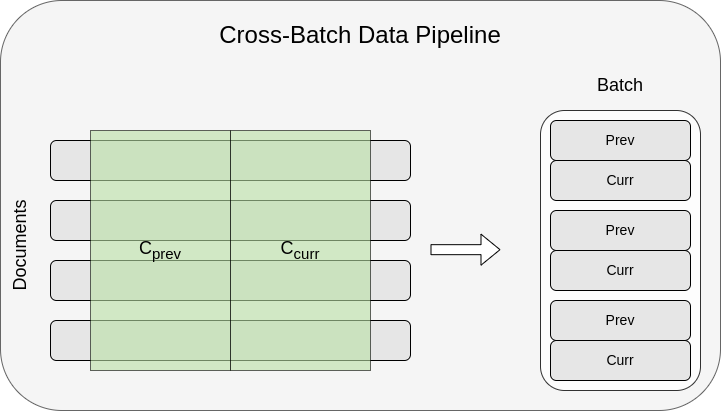
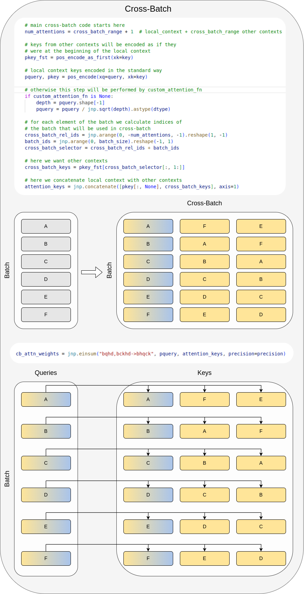

# LongLLaMA: Focused Transformer Training for Context Scaling - Cross-Batch and Data Pipeline

This catalog contains the implementation of [cross-batch](cross_batch.py) and [data pipelines](data_pipeline.py).


## Document-Aware Data Pipeline
`DocAwareDataPipeline` is implemented in [data_pipeline.py](data_pipeline.py) and works as follows.
It gets examples from the dataset document by document and assigns to each example an index in the batch.
After being assigned a batch index, tokens from this example are loaded into the assigned batch entry till the example ends.
After that, we take the next example and assign it to this entry.
We use `<bos>` and `<eos>` tokens to separate the documents within one batch entry.
The logic to add those special tokens comes from the `TextProcessor` defined in [EasyLM/data.py](../EasyLM/data.py).


We also provide `KPackingDAPipeline` that is similar to the pipeline described above but allows for the assignment of multiple entries of the
batch to a single document.
It assigns `k` entries to a document by using `DocAwareDataPipeline`
with `k` times larger sequence length and `k` times smaller batch and reshaping the output.
We use it to manipulate the number of positives and negatives inside cross-batch.

The figure below illustrates the `KPackingDAPipeline` with `k=2`.
<div align="center">




</div>

## Cross-Batch
Here we will focus on the training mode of FoT, the inference mode is described briefly in the [main README.md](../README.md).


In training standard transformer decoder model:
* inputs a batch of data
* processes each batch entry independently
* returns logits for probability distribution over the next token

Whereas FoT augmented model:
* inputs a batch of data
* processes each batch entry independently in non-memory layers, **but uses cross-batch attention in memory layers**
* returns logits for probability distribution over the next token

As we can see the difference between FoT and a standard model lies in how the attention is done in memory layers.

Before we dive deeper into cross-batch let's define local and additional context:
* by **local context**, we will mean a context that is processed in the model in non-memory layers
* by **additional context**, we will mean context that is additionally accessed in memory layers

Now, how does the cross-batch work.
Briefly speaking, cross-batch makes queries from memory layers attend to both keys from their **local context**
(as in standard attention) and keys coming from other elements of the batch (**additional context**).
There is one detail about positional encodings. 
In our experiments with smaller models we have disabled positional encodings in memory layers.
In LongLLaMA we encode **local context** in the standard way, whereas keys from **additional context** as if they were at the beginning of the local context.

Let's look at the part of the code from [cross_batch.py](cross_batch.py) that selects batch entries for cross-batch attention.

```python
cross_batch_rel_ids = jnp.arange(0, -num_attentions, -1).reshape(1, -1)
batch_ids = jnp.arange(0, batch_size).reshape(-1, 1)
cross_batch_selector = cross_batch_rel_ids + batch_ids

# here we want other contexts
cross_batch_keys = pkey_fst[cross_batch_selector[:, 1:]]

# here we concatenate local context with other contexts
attention_keys = jnp.concatenate([pkey[:, None], cross_batch_keys], axis=1)

# cb_attn_weights[b, h, q, c, k] = \sum_{d}pquery[b,q,h,d]*attention_keys[b,c,k,h,d]
cb_attn_weights = jnp.einsum("bqhd,bckhd->bhqck", pquery, attention_keys, precision=precision)
```
In the code above:
* `pkey_fst` - are keys encoded as if they were at the beginning of the local context (we use [RoPE](https://arxiv.org/abs/2104.09864) positional encoding)
* `pkey` and `pquery` - are encoded in a standard way (as in non-memory layers)

The first three lines create a selector `cross_batch_selector` of shape `[BATCH_SIZE, num_attentions]`.
The value of `cross_batch_selector[b]` is a list of batch entries to which a query from batch `b` can attend to.
It contains both the local context of the queries in entry `b` and `num_attentions - 1` additional contexts.
Below is an example of `cross_batch_selector` for `num_attentions=3`, `BATCH_SIZE=6`.
```
[
  [0, -1, -2],
  [1,  0, -1],
  [2,  1,  0],
  [3,  2,  1],
  [4,  3,  2],
  [5,  4,  3],
]
```
In the remaining lines, we use `cross_batch_selector` to gather keys for each batch entry for cross-batch attention.  
For example, when we use the above `cross_batch_selector`, then queries related to the third batch entry will attend
to keys from
* The third batch entry (**local context**)
* The second and the first batch entry (**additional context**)

The remaining lines of code handle masking, and `cross_batch_stepping` that allows the use of multiple cross-batches in one data batch.

The figure below illustrates the cross-batch attention.

<div align="center">



</div>

### Cross-batch masking and stepping

#### Basic masking to prevent infromation leak
The code shown above makes each batch entry attend to `cross_batch_range` previous (modulo) batch entries.
To avoid information leaks, we mask attention to batch entries that occur later in the batch.  
To be more precise, consider the `cross_batch_selector` example from above:  
```
[
  [0, -1, -2],
  [1,  0, -1],
  [2,  1,  0],
  [3,  2,  1],
  [4,  3,  2],
  [5,  4,  3],
]
```
For each batch entry, it shows what batch entries it attends to before masking. Now after the 
masking described above the attention looks like this:  
```
[
  [0,  -,  -],
  [1,  0,  -],
  [2,  1,  0],
  [3,  2,  1],
  [4,  3,  2],
  [5,  4,  3],
]
```
That is, the first batch entry attends only to itself, the second one to itself and previous batch entry, and so on.

#### Cross-batch stepping
Briefly speaking, `cross_batch_stepping` is designed to work with `KPackingDAPipeline` and `k > 1`. It allows simultaneous training with different cross-batch range values.  
It works as follows. 
It processes the batch in packs of size `k`.
For the `i`'th entry of each pack it chooses the total number of batch entries to attend to by evaluating   
`step_size = ceil(cross_batch_range + 1, max(k - 1, 1))`  
`min(i * step_size  + 1, cross_batch_range + 1)`  
the cross-batch range for `i`'the entry is, therefore, the value above minus `1` (one of the entries is the local context).  
For example for `batch_size = 8`, `cross_batch_range=6` and `doc_aware_k4` data pipeline we have:   
```
batch_entry 0 has cross_batch_range = 0
batch_entry 1 has cross_batch_range = 1
batch_entry 2 has cross_batch_range = 2
batch_entry 3 has cross_batch_range = 3
batch_entry 4 has cross_batch_range = 0
batch_entry 5 has cross_batch_range = 3
batch_entry 6 has cross_batch_range = 6
batch_entry 7 has cross_batch_range = 6
```

## Misc
This document describes the newest implementation used to create the LongLLaMA models. In our experiments with smaller models we have used a slightly different (less data optimal) implementation that called the model two times to generate the $C_{prev}$ and $C_{curr}$. It then only used $C_{prev}$ to gather additional contexts in cross-batch attention.

In this implementation padded documents are not supported in cross-batch (they are not masked in cross-batch). Instead, when a document ends, we add `<eos>` and `<bos>` tokens and load another document. The training step also does not use custom attention masks.


